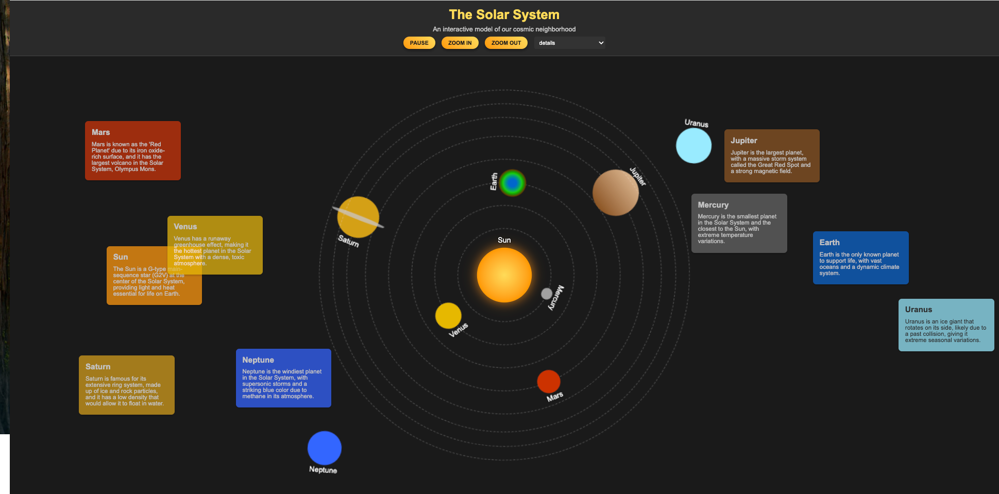

# Solar System

This project displays a simple representation of the solar system using HTML and CSS.

## Preview

## Getting Started

To view the solar system animation, simply open the `index.html` file in your web browser.

## Solar System Components

The solar system consists of the following components:

- Sun
- Mercury
- Venus
- Earth
- Mars

## Usage

To use the solar system animation in your project, follow these steps:

1. Copy the HTML code from `index.html` and paste it into your HTML file.
2. Copy the CSS code from `input.css` and paste it into your CSS file.
3. Ensure that both the HTML and CSS files are linked properly in your project.

## Contributing

Contributions are welcome! Feel free to open an issue or submit a pull request.

